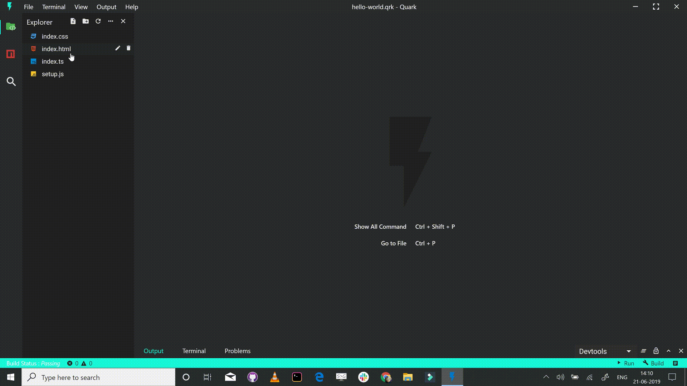
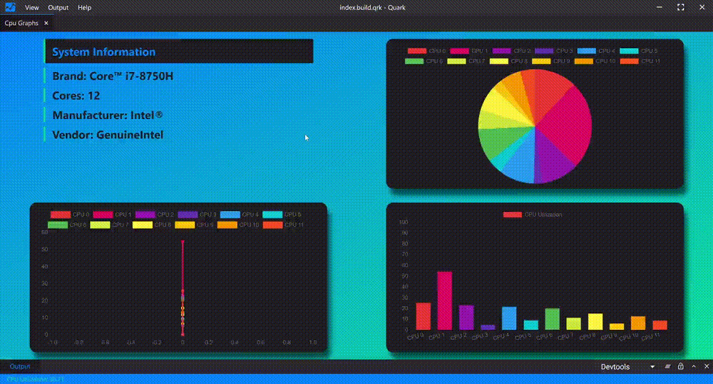
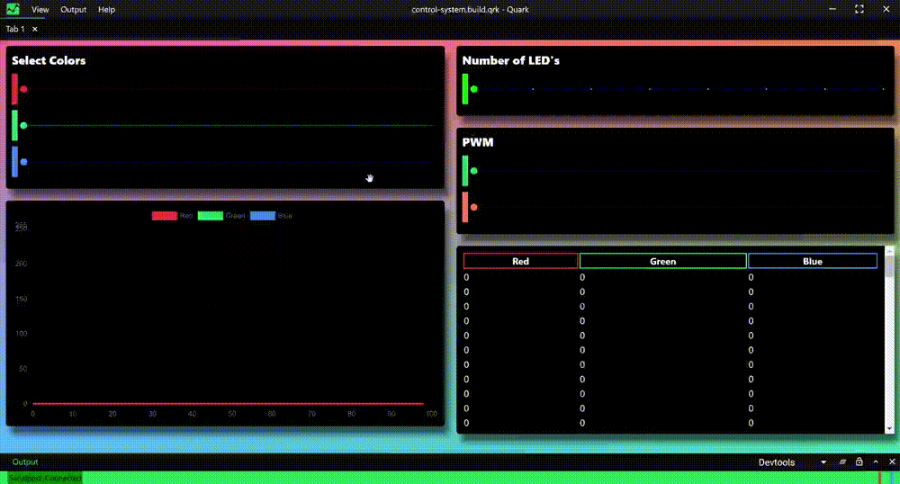
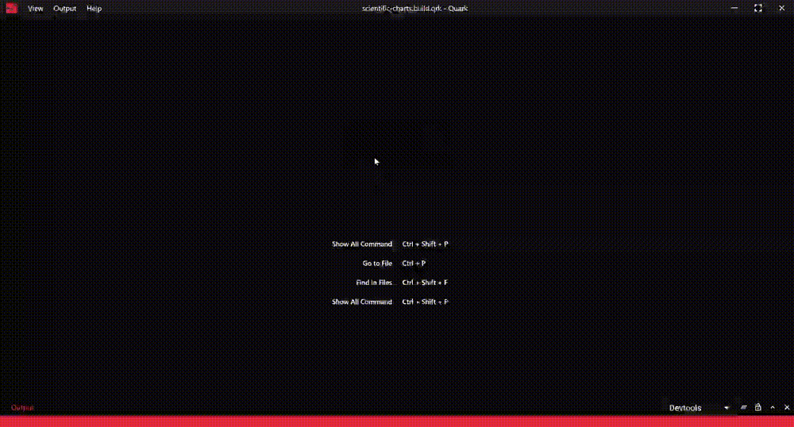
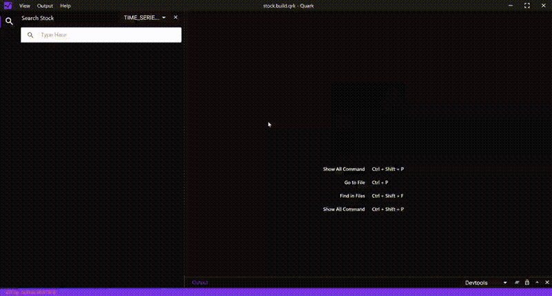
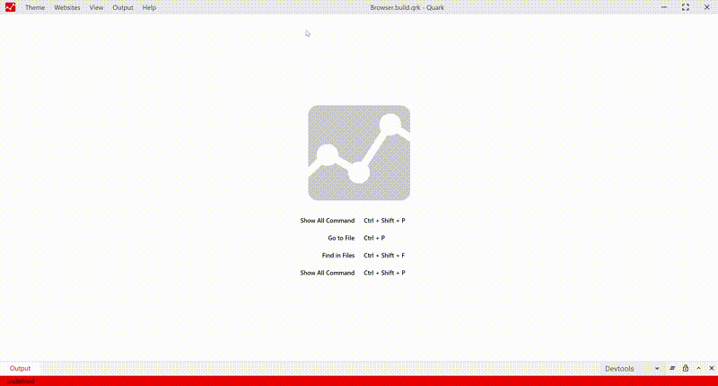

# The Repository

This repo contains the website and documentation for the [Quark](https://quarkjs.io) product.

## Quark

Quark is a general purpose software tool specifically designed to help you create projects written in HTML, CSS and JavaScript with native desktop app like capabilities.

## Goals

#### ⚡ Rapid prototyping and project development
Projects build with Quark should be easy and quick to setup.

#### 💻 Cross-platform
Projects build with Quark should run on all platforms such as Windows, Linux and Mac, sharing the same code base.

#### 🐱 Simplicity
Quark is built with simplicity in mind, so that creating projects with Quark is enjoyable, easy to learn, and accessible to just about anyone with basic programming skills.

## Showcase 

#### System resource monitor
Monitors system resources. View CPU loads, memory usage, process explorer.

#### Digital control systems
Digital control system made with Arduino UNO using pre-installed serialport library.

#### Plot Charts
Plot charts using plotly.js

#### Stock analyzing app
Analyze historic/real-time stock data.

#### News App
News app with multiple country and source filter.

#### Web Browser
Web browser with multiple split view support.

## Feedback

* Ask a question on Stack Overflow
* [File an issue](https://github.com/Nishkalkashyap/Quark-docs/issues)